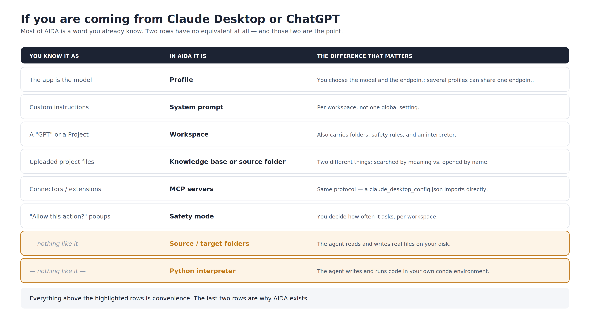
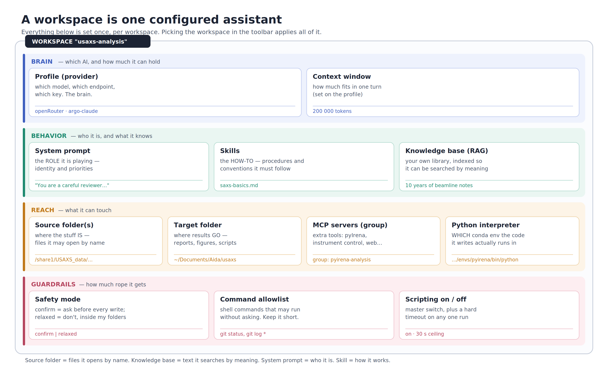
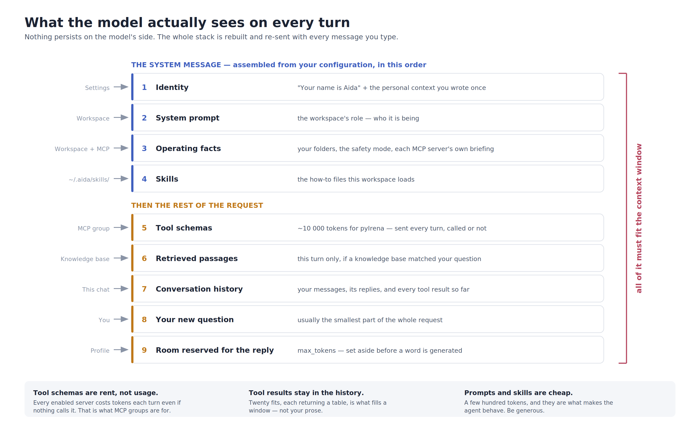
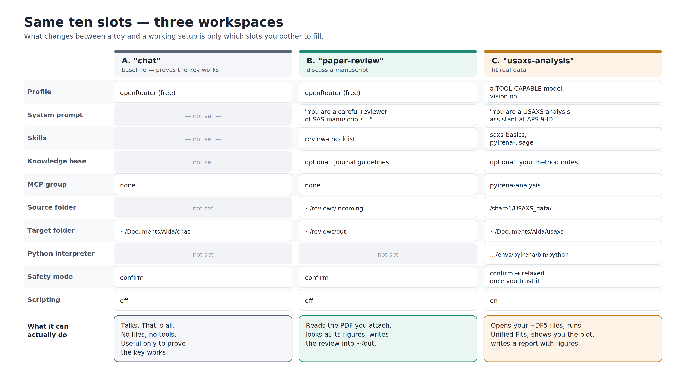

# AIDA in ten boxes — concepts, and three setups that actually do something

**Who this is for:** you have used Claude Desktop, ChatGPT, or Copilot, and
someone just told you to use AIDA. This page explains what the words in
AIDA's dialogs mean, and gives you three configurations you can copy.

**Status:** draft for review. The four figures are generated by
[`figures/make_figures.py`](figures/make_figures.py) — edit the data blocks
in that script and re-run it rather than redrawing anything by hand:

```bash
python docs/figures/make_figures.py --png     # SVG for slides, PNG for anything else
```

---

## 1. The one idea

A commercial chat app gives you **one** assistant with **one** personality
and **no** access to your disk. AIDA gives you **as many assistants as you
want**, each one a named bundle of settings, each with a defined slice of
your filesystem and your instruments.

That bundle is called a **workspace**. Picking a workspace in the toolbar is
the whole configuration act — everything else was decided when the workspace
was made. Switching workspaces always starts a new conversation, because you
have switched assistants, not topics.

### If you are coming from a commercial desktop app



| You know it as | In AIDA it is | Difference that matters |
|---|---|---|
| The app *is* the model | **Profile** | You choose the model and the endpoint. Several profiles can point at the same endpoint with different settings. |
| Custom instructions / Project instructions | **System prompt** | Per workspace, not global. |
| A "GPT" or a Project | **Workspace** | Also carries folders, safety rules, and an interpreter. |
| Uploaded project files | **Knowledge base (RAG)** or **source folder** | Two different things — see §3. |
| Connectors / Extensions | **MCP servers** | Same protocol; a `claude_desktop_config.json` imports directly. |
| "Allow this action?" popups | **Safety mode** | You set how often it asks, per workspace. |
| — (does not exist) | **Source / target folder** | The agent reads and writes real files on your disk. |
| — (does not exist) | **Python interpreter** | The agent writes and runs code in *your* conda environment. |

The last two rows are why AIDA exists. Everything above them is convenience;
those two are the point.

---

## 2. Figure A — anatomy of a workspace



Ten things make up one workspace, in four groups: **Brain** (which AI),
**Behavior** (who it is and what it knows), **Reach** (what it can touch),
and **Guardrails** (how much rope it gets). Guardrails is deliberately its
own band rather than a frame drawn around Reach — one more group to read is
easier than one nested relationship to explain.

---

## 3. What each box is

Two lines and an example each. Details live in the linked file.

### Profile (provider) — the brain
Which model, at which endpoint, with which key. AIDA never stores the key
itself, only a name pointing at your OS keychain.
Change this and you change how smart, how fast, and how expensive the
assistant is — nothing else about the workspace moves.
> *Example:* `openRouter` → `https://openrouter.ai/api/v1`, model
> `openrouter/free`. Or `argo-claude` → Claude via the ANL proxy.
→ [providers-and-secrets.md](providers-and-secrets.md)

### System prompt — the role
A paragraph telling the agent who it is being for this workspace. It is the
first thing the model reads, every turn.
Keep it about *identity and priorities*, not step-by-step procedure — steps
belong in a skill.
> *Example:* "You are a careful reviewer of small-angle scattering
> manuscripts for JAC. Prefer questions over verdicts. Never rewrite the
> author's text."
→ [workspaces.md](workspaces.md)

### Safety mode — how much oversight
`confirm` pops a dialog before every write, delete, or command inside your
folders. `relaxed` lets those through silently — but only inside the
workspace's own folders.
Anything *outside* the configured folders always asks, in both modes, and
`fetch_url` always asks, always.
> *Example:* review workspace → `confirm`. Scratch analysis folder you have
> backed up → `relaxed`.
→ [safety-and-permissions.md](safety-and-permissions.md)

### Skills — the how-to
Markdown files in `~/.aida/skills/` holding procedures and conventions,
loaded into the system context when the workspace is active.
This is where "always report Rg in Å and say which Q range you fitted" goes.
The system prompt says who; a skill says how.
> *Example:* `saxs-basics.md` (Q units, Irena terminology),
> `review-checklist.md` (what a review must cover).
→ [mcp-servers.md](mcp-servers.md#adding-editing-via-the-gui) (Skills… browser)

### Knowledge base (RAG) — your library, searchable
A folder of your own documents, chunked and indexed locally, so the agent
can look things up mid-answer instead of relying on what it was trained on.
Not the same as a source folder: a source folder is files the agent *opens
by name*; a knowledge base is text it *searches by meaning*.
> *Example:* your Obsidian notes folder, or ten years of beamline SOPs,
> indexed as `usaxs-notes`.
→ [knowledge-bases.md](knowledge-bases.md)

### MCP servers — extra tools
External programs AIDA launches and talks to, each offering the agent a set
of callable tools. This is how the agent fits data rather than describing
how you would fit data.
Grouped, because each tool costs context on every single turn — pyIrena's
~70 tools cost ~10,000 tokens per request whether used or not.
> *Example:* group `pyirena-analysis` → the `pyirena-mcp` server → Unified
> Fit, Size Distribution, plotting, NXcanSAS reading.
→ [mcp-servers.md](mcp-servers.md) · [pyirena.md](pyirena.md)

### Source folder(s) — where to find stuff
Folders the agent may read from without asking. List the data, not the whole
disk.
Configuring a folder here is what *makes it allowed*; nothing else grants
access.
> *Example:* `/share1/USAXS_data/2026_08`
→ [workspaces.md](workspaces.md)

### Target folder — where to put stuff
The single folder results are written into: reports, figures, saved scripts.
Generated images land in a `figures/` subfolder next to the report, linked
relatively — Obsidian opens the result as-is.
> *Example:* `~/Documents/Aida/usaxs-analysis`
→ [workspaces.md](workspaces.md)

### Python interpreter — the environment for its code
Full path to the `python` binary of the conda/venv environment the agent's
scripts run in. A *path*, not an environment name.
Leave it unset and scripts run in AIDA's own environment, which almost
certainly lacks your analysis packages.
> *Example:* `~/miniconda3/envs/pyirena/bin/python`
→ [coding-and-scripting.md](coding-and-scripting.md)

### Command allowlist — which shell commands skip the prompt
A short list of exact command patterns `run_command` may run without asking.
`git log *` means "that prefix plus anything".
Keep it to read-only commands. For "run some Python without hand-approving
each time", the answer is `run_python_script`, not this list.
> *Example:* `git status`, `git log *`
→ [safety-and-permissions.md](safety-and-permissions.md#the-command-allowlist)

### Also in the box, less often changed
- **Scripting on/off** — a master switch. Off means the run-code tools are
  never even offered to the model.
- **Script timeout** — hard ceiling in seconds (default 30) on any one
  script or command.
- **Quick Tasks** — up to ten saved prompts per workspace, one double-click
  away. The cheapest usability win in the app.
- **Sidecar folder name** — what the figures subfolder is called
  (default `figures`).

---

## 4. Figure B — what the model actually sees each turn



Users assume the model sees "my question". It sees all nine layers above,
reassembled from scratch on every single turn — nothing persists on the
model's side between messages.

Three consequences worth saying out loud in the talk:

1. **Tool schemas are rent, not usage.** Enabling every MCP server "just in
   case" spends thousands of tokens per turn on tools nobody calls. That is
   what MCP *groups* are for.
2. **Tool results live in the history forever.** Twenty fits, each returning
   a table, is what fills a window — not your prose.
3. **Skills and system prompts are cheap; be generous with them.** They are
   a few hundred tokens and they are what makes the agent behave.

→ [context-and-limits.md](context-and-limits.md)

---

## 5. Figure C — three workspaces, same box, different filling



Same ten slots each time. What separates a toy from a working setup is only
which slots you bothered to fill — which is why the greyed-out cells carry
the message as much as the filled ones do.

---

## 6. Minimum working configurations

### 0. Prerequisites (once)

```bash
pip install --pre "aida-workbench[gui,docs]"
aida doctor          # must be clean before anything else
aida-gui
```

**Get a key.** For trying AIDA out, OpenRouter is free and takes two
minutes: make an account at <https://openrouter.ai>, create an API key.

> ⚠️ **OpenRouter free models are neither private nor secure.** Your
> prompts and data are stored by the provider and may be used for training.
> Use it to learn the app. Never point it at unpublished results, proposal
> text, or anything under embargo. For real work use ANL Argo, a direct
> Claude/OpenAI key, or a local Ollama model.

In the GUI: **Providers… → Add**

| Field | Value |
|---|---|
| Name | `openRouter` |
| Kind | `openai_compat` |
| Base URL | `https://openrouter.ai/api/v1` |
| Model | `openrouter/free` |
| Secret ref | `openrouter` |
| Secret value | *your key* (stored in the OS keychain, never in a file) |
| Max tokens | `8000` |
| Context window | your model's real window — **not** the same field as max tokens |
| Supports vision | on, if the model can see images |

Press **Test**. Green means the key works. Equivalent CLI:

```bash
aida config secret set openrouter <your-key>
# then add the profile in providers.yaml, or via the dialog above
```

---

### A. Simple chat — 5 minutes, proves the plumbing

Only worth doing to confirm the key works. It is a worse ChatGPT.

```bash
aida workspace new chat \
    --profile openRouter \
    --target-folder "~/Documents/Aida/chat" \
    --mcp-group none \
    --safety confirm
```

Pick `chat` in the toolbar, ask it anything. If it answers, your provider is
configured and every failure from here on is about folders or tools, not the
key.

---

### B. Paper discussion — the first genuinely useful one

Read a manuscript, look at its figures, write a structured review into a
folder.

```bash
aida workspace new paper-review \
    --profile openRouter \
    --source-folders "~/Documents/reviews/incoming" \
    --target-folder "~/Documents/reviews/out" \
    --skills review-checklist \
    --system-prompt "You are a careful reviewer of small-angle scattering manuscripts. Ask questions rather than pronounce verdicts. Quote the section you are commenting on. Never rewrite the author's text." \
    --mcp-group none \
    --safety confirm
```

Copy a starter skill into place first, then edit it to match what you
actually review:

```bash
cp skills/review-checklist.md ~/.aida/skills/
```

Then, in the GUI: attach the PDF to your message (drag it in) and try, in
this order —

1. *"Summarize the claims and the evidence for each."*
2. *"What figures are in that paper?"* ← this is what triggers figure
   extraction; nothing is extracted until you ask.
3. *"Show me figure 3 and tell me whether the fit supports the claim."*
   (needs a vision-capable model)
4. *"Write the review to the target folder as review-<name>.md."*

**Expect a confirmation dialog** on step 4 — that is `safety: confirm`
working. Multi-column PDFs pair captions imperfectly; optional Mistral OCR
fixes that but uploads the document, and asks first
([documents.md](documents.md#optional-mistral-ocr)).

---

### C. pyIrena data analysis — the real target

```bash
pip install "pyirena[mcp]"
aida mcp add-pyirena --data-root /share1/USAXS_data
aida mcp server test pyirena-mcp        # must list ~70 tools
```

`add-pyirena` writes the server, its group `pyirena-analysis`, and installs
the `saxs-basics` and `pyirena-usage` skills — it never overwrites a skill
file you already edited. The GUI equivalent is **MCP Servers… → Add
pyIrena…**.

```bash
aida workspace new usaxs-analysis \
    --profile <a tool-capable profile> \
    --source-folders "/share1/USAXS_data/2026_08" \
    --target-folder "~/Documents/Aida/usaxs-analysis" \
    --mcp-group pyirena-analysis \
    --skills saxs-basics,pyirena-usage \
    --python-interpreter ~/miniconda3/envs/pyirena/bin/python \
    --safety confirm
```

> ⚠️ **This is where a free OpenRouter model will let you down.** OpenRouter
> routes to whatever free model happens to be available, so tool calling is
> a coin flip: in our testing one session worked but called every tool
> twice, and the next session failed outright. Either way the agent ends up
> talking about fitting instead of fitting. Use Argo Claude, a direct
> Claude/OpenAI key, or an OpenRouter model you have chosen explicitly for
> tool use. Turn `supports_vision` on so it can look at the plots it makes.

A first session that proves everything works:

1. *"What datasets are in the source folder?"* → exercises MCP file
   discovery.
2. *"Open <sample>.h5 and plot I(Q)."* → the plot appears as an image in
   chat, not as a file path.
3. *"Add a Unified level and fit it. Show me the fit and the residuals."*
4. *"Is that fit any good?"* → only meaningful with vision on.
5. *"Tabulate Rg and B for every sample in the folder and write a Markdown
   report with the plots."* → figures land in `figures/` beside the report.

Once you trust it in that folder, switch to `--safety relaxed` and stop
clicking. Save steps 1 and 5 as **Quick Tasks** and you never type them
again.

---

## 7. The five mistakes everybody makes

1. **`max_tokens` set to the model's context size.** They are different
   fields. `max_tokens` is how long the *reply* may be (4000–16000);
   `context_window` is the model's total. Getting this wrong breaks every
   turn. `aida doctor` catches it.
2. **Every MCP server enabled at once.** Thousands of tokens of tool schemas
   per turn, and a small model that cannot choose between 100 tools. Use
   groups.
3. **Forgetting to add the source folder.** The agent is not being difficult
   when it asks permission — the folder simply is not in its allowed set.
4. **A bare command as the MCP server path.** A GUI app inherits no shell
   `PATH`. Always the absolute path to the executable.
5. **Expecting `relaxed` to mean "no questions".** Paths outside your
   folders, non-allowlisted shell commands, and every URL fetch still ask,
   in every mode. By design.

---

## 8. Notes for the talk

- **Figure D** (§1) opens: everything they already know, and the two rows
  that have no equivalent.
- **Figure A** (§2) is the spine of the talk. Consider walking it one band
  at a time rather than showing all four at once.
- **Figure C** (§5) is the payoff: same box, three fillings, visibly
  different capability.
- **Figure B** (§4) is the "why does it get slow / why did it forget"
  slide. It can be skipped for a purely introductory audience and kept for
  the follow-up.
- Screenshots to slot in alongside: the **Providers** dialog (next to
  Figure D or §6.0), **Settings** (assistant name + personal context, which
  is layer 1 of Figure B), and the **Workspace Management** dialog (next to
  Figure A, so the boxes map onto real fields).
- Editing a figure: change the data lists in `figures/make_figures.py` and
  re-run. Colours, band names, and every string live at the top of each
  `figure_*()` function.
